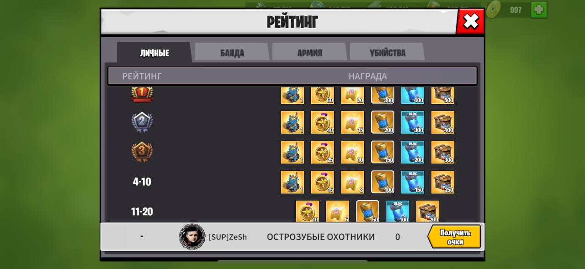
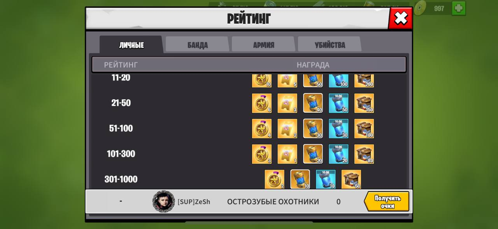
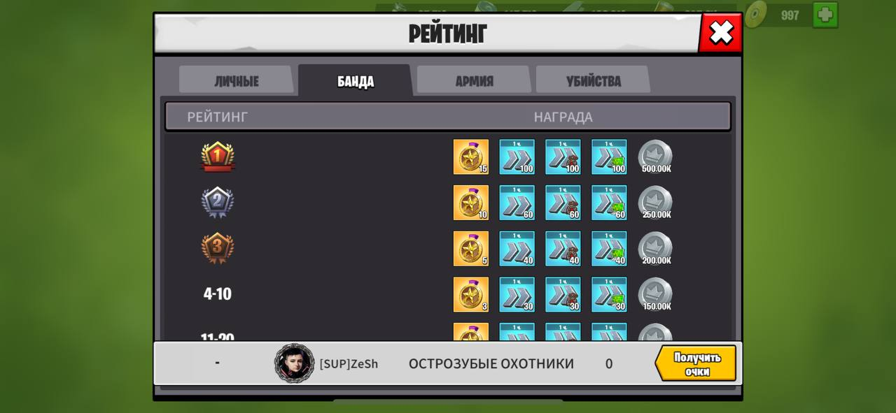
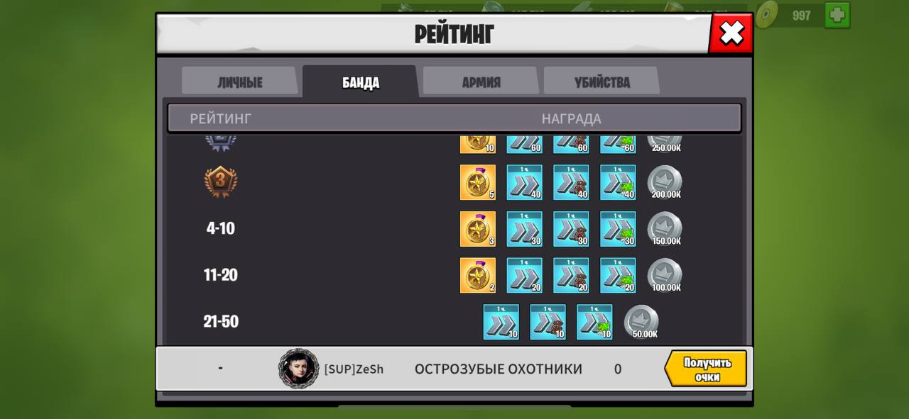
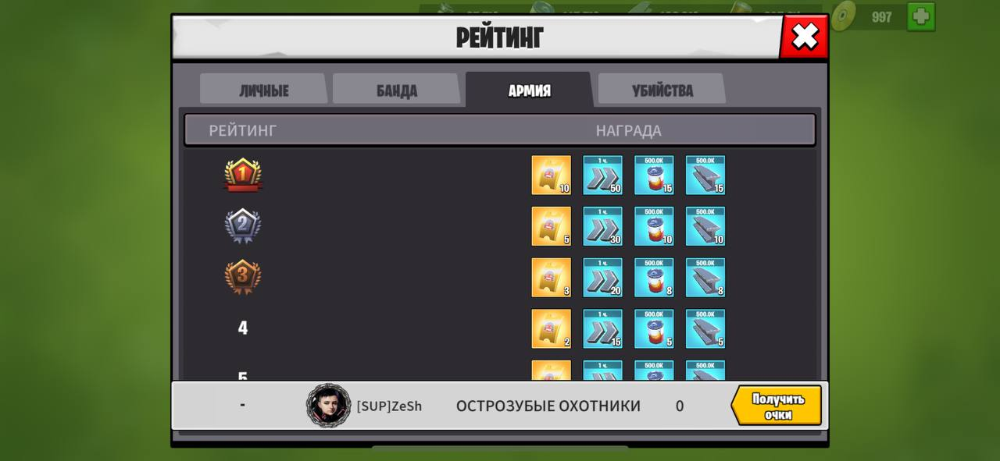
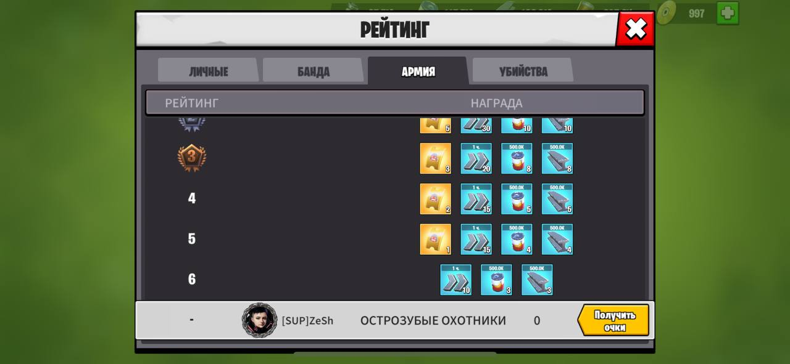
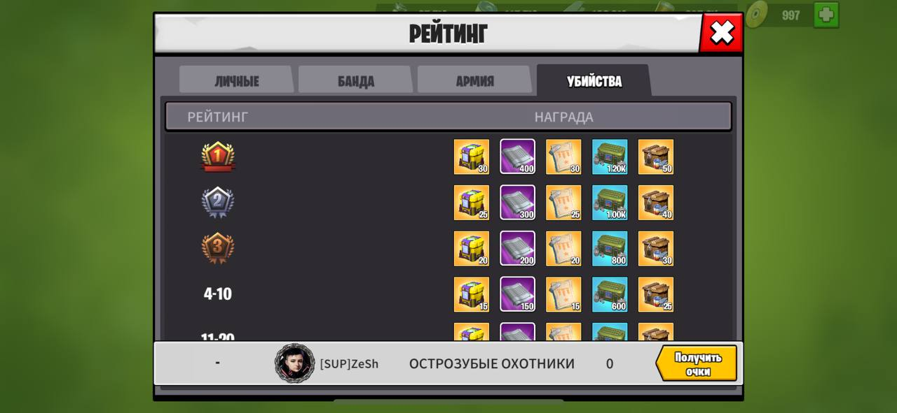
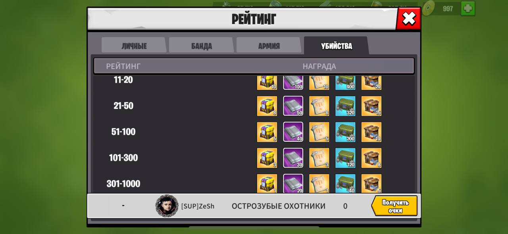
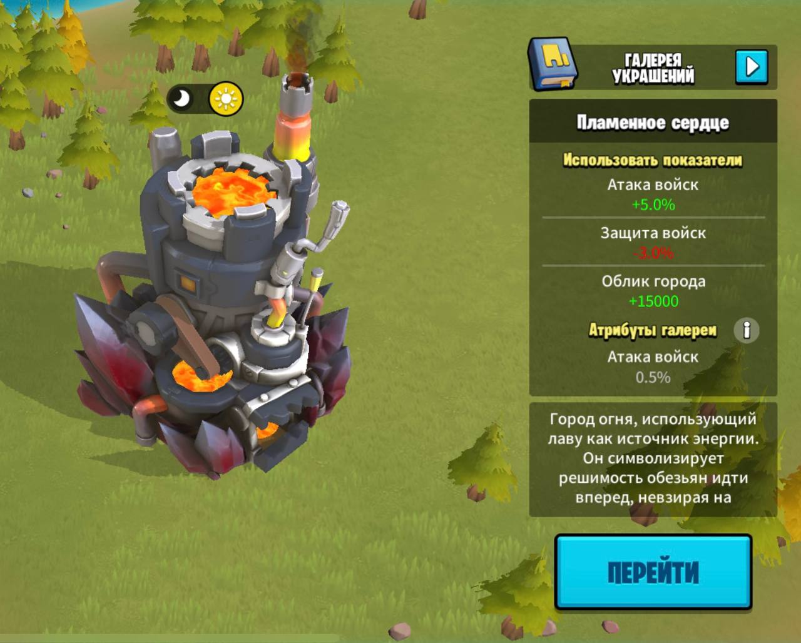

# Огненная звезда

В исследовательских архивах человечества зафиксирована планета под названием "Огненная звезда", которая время от времени демонстрирует странные изменения на своей орбите. 
У Огненной Звезды совершенно новая поверхность, с лавой и вулканами, предлагающими уникальный опыт, а также совершенно новые истории разрушения.

### Награды за индивидуальный рейтинг (Топ игроков)

|    №     |               Награды               |                    -                     |                        -                         |               -                |            -            |                                                     |
| :------: | :---------------------------------: | :--------------------------------------: | :----------------------------------------------: | :----------------------------: | :---------------------: | :-------------------------------------------------: |
|    1     | [[#Скин города "Пламенное сердце"]] | Универсальные легендарные медали (60 шт) | Билеты  на  роскош- ный пир  (20 шт) | Нано- материал  (300 шт) | Сила мехов 10к (400 шт) | Элитный Ящики с ресурсами на выбор по 100к (500 шт) |
|    2     | [[#Скин города "Пламенное сердце"]] | Универсальные легендарные медали (40 шт) | Билеты  на  роскош- ный пир  (15 шт) | Нано- материал (200 шт)  | Сила мехов 10к (300 шт) | Элитный Ящики с ресурсами на выбор по 100к (400 шт) |
|    3     | [[#Скин города "Пламенное сердце"]] | Универсальные легендарные медали (25 шт) | Билеты  на  роскош- ный пир  (10 шт) | Нано- материал (150 шт)  | Сила мехов 10к (200 шт) | Элитный Ящики с ресурсами на выбор по 100к (300 шт) |
|   4-10   | [[#Скин города "Пламенное сердце"]] | Универсальные легендарные медали (15 шт) | Билеты  на  роскош- ный пир  (8 шт)  | Нано- материал (100 шт)  | Сила мехов 10к (150 шт) | Элитный Ящики с ресурсами на выбор по 100к (250 шт) |
|  11-20   |                  -                  | Универсальные легендарные медали (10 шт) | Билеты  на  роскош- ный пир  (5 шт)  |  Нано- материал (50 шт)  | Сила мехов 10к (100 шт) | Элитный Ящики с ресурсами на выбор по 100к (200 шт) |
|  21-50   |                  -                  | Универсальные легендарные медали (6 шт)  | Билеты  на  роскош- ный пир   (3 шт) |  Нано- материал (40 шт)  | Сила мехов 10к (50 шт)  | Элитный Ящики с ресурсами на выбор по 100к (150 шт) |
|  51-100  |                  -                  | Универсальные легендарные медали (4 шт)  | Билеты  на  роскош- ный пир  (2 шт)  |  Нано- материал (30 шт)  | Сила мехов 10к (30 шт)  | Элитный Ящики с ресурсами на выбор по 100к (100 шт) |
| 101-300  |                  -                  | Универсальные легендарные медали (3 шт)  | Билеты  на  роскош- ный пир  (1 шт)  |  Нано- материал (20 шт)  | Сила мехов 10к (20 шт)  | Элитный Ящики с ресурсами на выбор по 100к (80 шт)  |
| 301-1000 |                  -                  | Универсальные легендарные медали (2 шт)  |                        -                         |  Нано- материал (10 шт)  | Сила мехов 10к (10 шт)  | Элитный Ящики с ресурсами на выбор по 100к (50 шт)  |

(Скриншот №1 Награды за индивидуальный рейтинг (1-10 места))

(Скриншот №2 Награды за индивидуальный рейтинг (11-300 места))

### Награды за рейтинг банды

|   №   |                 Награды                  |                     -                      |                   -                   |                     -                     |         -         |
| :---: | :--------------------------------------: | :----------------------------------------: | :-----------------------------------: | :---------------------------------------: | :---------------: |
|   1   | Универсальные легендарные медали (15 шт) | Универсальные ускорители на 1 час (100 шт) | Ускорители обучения на 1 час (100 шт) | Ускорители исследований на 1 час (100 шт) | Монеты банды 500к |
|   2   | Универсальные легендарные медали (10 шт) | Универсальные ускорители на 1 час (60 шт)  | Ускорители обучения  на 1 час (60 шт) | Ускорители исследований на 1 час (60 шт)  | Монеты банды 250к |
|   3   | Универсальные легендарные медали (5 шт)  | Универсальные ускорители на 1 час (40 шт)  | Ускорители обучения  на 1 час (40 шт) | Ускорители исследований на 1 час (40 шт)  | Монеты банды 200к |
| 4-10  | Универсальные легендарные медали (3 шт)  | Универсальные ускорители на 1 час (30 шт)  | Ускорители обучения  на 1 час (30 шт) | Ускорители исследований на 1 час (30 шт)  | Монеты банды 150к |
| 11-20 | Универсальные легендарные медали (2 шт)  | Универсальные ускорители на 1 час (20 шт)  | Ускорители обучения  на 1 час (20 шт) | Ускорители исследований на 1 час (20 шт)  | Монеты банды 100к |
| 21-50 |                    -                     | Универсальные ускорители на 1 час (10 шт)  | Ускорители обучения  на 1 час (10 шт) | Ускорители исследований на 1 час (10 шт)  | Монеты банды 50к  |

(Скриншот №3 Награды за рейтинг банд (1-10 места))

(Скриншот №4 Награды за рейтинг банд (11-50 места))

### Награды за рейтинг армии

|  №  |             Награды             |                     -                     |         -         |          -          |
| :-: | :-----------------------------: | :---------------------------------------: | :---------------: | :-----------------: |
|  1  | Билеты на роскошный пир (10 шт) | Универсальный ускоритель на 1 час (50 шт) | Пища 500к (15 шт) | Железо 500к (15 шт) |
|  2  | Билеты на роскошный пир (8 шт)  | Универсальный ускоритель на 1 час (30 шт) | Пища 500к (10 шт) | Железо 500к (10 шт) |
|  3  | Билеты на роскошный пир (6 шт)  | Универсальный ускоритель на 1 час (20 шт) | Пища 500к (8 шт)  | Железо 500к (8 шт)  |
|  4  | Билеты на роскошный пир (4 шт)  | Универсальный ускоритель на 1 час (15 шт) | Пища 500к (5 шт)  | Железо 500к (5 шт)  |
|  5  | Билеты на роскошный пир (2 шт)  | Универсальный ускоритель на 1 час (15 шт) | Пища 500к (4 шт)  | Железо 500к (4 шт)  |
|  6  |                -                | Универсальный ускоритель на 1 час (10 шт) | Пища 500к (3 шт)  | Железо 500к (3 шт)  |

(Скриншот №5 Награды за рейтинг армии (1-4 места))

(Скриншот №6 Награды за рейтинг армии (4-6 места))

### Награды за рейтинг убийств

|    №     |                Награды                 |           -           |           -           |                      -                       |                           -                           |
| :------: | :------------------------------------: | :-------------------: | :-------------------: | :------------------------------------------: | :---------------------------------------------------: |
|    1     | Марсианский сундук с чертежами (30 шт) | Нано-волокно (400 шт) | Чертёж оружия (30 шт) | Ящик с материалами для оружия  (1.200 шт) | Элитный Ящики с ресурсами на выбор по 100к (50 шт) |
|    2     | Марсианский сундук с чертежами (25 шт) | Нано-волокно (300 шт) | Чертёж оружия (25 шт) | Ящик с материалами для оружия  (1.000 шт) | Элитный Ящики с ресурсами на выбор по 100к (40 шт) |
|    3     | Марсианский сундук с чертежами (20 шт) | Нано-волокно (200 шт) | Чертёж оружия (20 шт) |  Ящик с материалами для оружия  (800 шт)  | Элитный Ящики с ресурсами на выбор по 100к (30 шт) |
|   4-10   | Марсианский сундук с чертежами (15 шт) | Нано-волокно (150 шт) | Чертёж оружия (15 шт) |  Ящик с материалами для оружия  (600 шт)  | Элитный Ящики с ресурсами на выбор по 100к (25 шт) |
|  11-20   | Марсианский сундук с чертежами (10 шт) | Нано-волокно (100 шт) | Чертёж оружия (10 шт) |  Ящик с материалами для оружия  (400 шт)  | Элитный Ящики с ресурсами на выбор по 100к (20 шт) |
|  21-50   | Марсианский сундук с чертежами (8 шт)  | Нано-волокно (50 шт)  | Чертёж оружия (8 шт)  |  Ящик с материалами для оружия  (320 шт)  | Элитный Ящики с ресурсами на выбор по 100к (15 шт) |
|  51-100  | Марсианский сундук с чертежами (5 шт)  | Нано-волокно (40 шт)  | Чертёж оружия (5 шт)  |  Ящик с материалами для оружия  (200 шт)  | Элитный Ящики с ресурсами на выбор по 100к (10 шт) |
| 101-300  | Марсианский сундук с чертежами (3 шт)  | Нано-волокно (30 шт)  | Чертёж оружия (3 шт)  |  Ящик с материалами для оружия  (120 шт)  | Элитный Ящики с ресурсами на выбор по 100к (8 шт)  |
| 301-1000 | Марсианский сундук с чертежами (1 шт)  | Нано-волокно (20 шт)  | Чертёж оружия (1 шт)  |  Ящик с материалами для оружия  (40 шт)   | Элитный Ящики с ресурсами на выбор по 100к (5 шт)  |

(Скриншот №5 Награды за рейтинг убийств (1-10 места))

(Скриншот №6 Награды за рейтинг убийств (11-1000 места))

## Скин города "Пламенное сердце"

| Атака войск | Защита войск | Облик города | Атрибут галереи  |
| ----------- | ------------ | ------------ | ---------------- |
| +5%         | -3%          | +15.000      | Атака войск 0.5% |

 (Скриншот №5 Скин города "Пламенное сердце")

#СкинГорода

Актуальная версия: 08.07.2025 11:48 (8:48 UTC)
